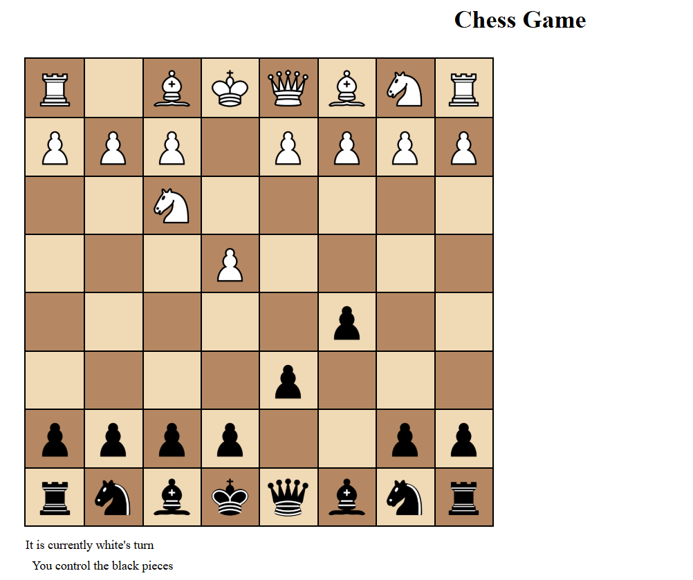

# ChessV2

ChessV2 is another iteration of the first Chess Game I made, now featuring a fully playable React frontend. 
The game leverages a C++ backend with Boost.Beast for WebSocket communication. 

It's missing some features such as castling and en passant implementation and having a stack to rewind moves.
Also not as many test as ChessV1. Mostly focused on trying to do new / different things over implementing old things that
I have already done.

The client is already included in the codebase, inside the frontend folder.
You can run it with the commands inside, the C++ code creates a server you can run which the client will attempt
to connect to on boot.

ChessV1 has all these but is text only, with no online capability. You can find ChessV1/Chess here: 
https://github.com/jordan-hoang/Chess

## Building with CMake

1. Clone the repository.

        git clone git@github.com:jordan-hoang/ChessV2.git

2. Create a new directory for building.

        mkdir build

3. Change into the new directory.

        cd build

4. Run CMake with the path to the source.

        cmake ../

5. Run make inside the build directory:

        make

After building, you’ll have the ChessV2 executable inside the build directory. 
Running it will start the Server, it can be modified easily to take Text Input.

The lower-case characthers such as 'p' means it is a "White Pawn" while "P" corresponds to a "Black Pawn"

A React frontend currently serves as the GUI and you would click on pieces to move them. 
Currently it's left click 2x. But I will probably add a drag and drop feature. You'll need to launch 2 clients,
the server won't let you control the opposing piece from the same client.

### Dependencies
This project requires:

1. C++17 or newer
2. PythonInterp (For googletest)
3. CMake >= 3.1
4. Boost.Beast (for WebSocket communication)
5. npm (for running the React frontend)

### Current Plans 

Frontend Polish: The React frontend will receive more polish for better usability and visual appeal.

### Possible additions I may add.

AI: Implement minmax algorithm, so the server can play against you.

Replay Game: Can save a copy of your game in CAN notation and use it to watch a playthrough of that game, perhaps
make it so that you can start in the middle of a game at some situation? Maybe make a Chess Snapshot feature.

Spectator feature: Can watch other players games, perhaps even add a takeover feature?

EnPassant and castling don't work and the check for the king cannot move isn't in from chessV1 yet.
Also all the tests haven't been ported.

Multiplayer Networking: The goal is to add multiplayer functionality to allow two players to play online.
